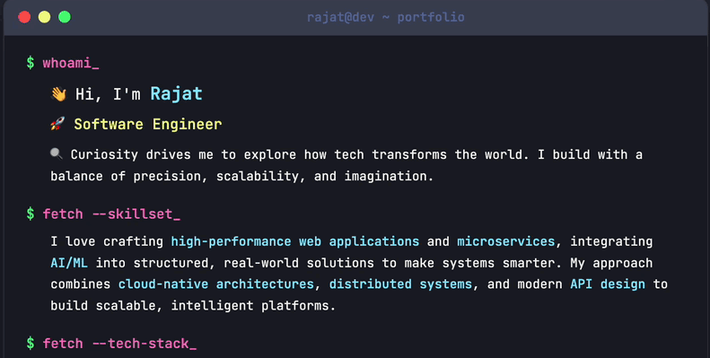
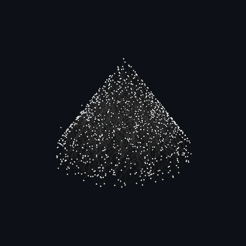
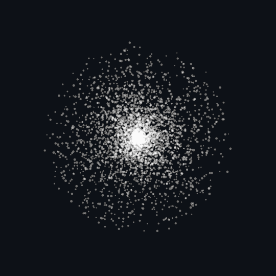
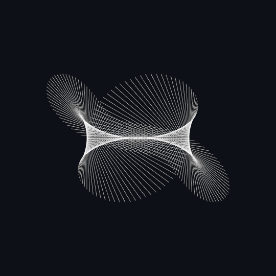

<!--first Gig-->

  
   
  
   

 
 
<!-- terminal photo-->

  

<!-- ====== Languages and Tools Section (Fixed) ====== -->

  

    

    
      

    <!-- Python -->
    
    <!-- Java -->
    
    <!-- JavaScript -->
    
    <!-- TypeScript -->
    
    <!-- Node.js -->
    
    <!-- Rust -->
    <!-- 'R' Logo (Bright Blue & White, visible on dark background) -->
   <!-- Bright Blue 'R' PNG (clearly visible on dark backgrounds) -->
    
    <!-- Go -->
    
    <!--Express js-->
   
    <!-- React.js -->
    
    <!-- Hugging Face -->
    
    <!-- LangChain (using LC logo) -->
     
    <!-- Vercel -->
    
    <!-- SageMaker -->
    
     
    <!-- Lambda -->
    
    <!--AWS--->
    
    <!-- GCP -->
    
    <!-- Docker -->
    
    <!-- Kubernetes -->
    
    <!-- GraphQL -->
    
    <!-- REST API (tabler icon) -->
    
    <!-- Apache Kafka -->
    
    <!-- Unix/Linux -->
    
    <!-- Git -->
    
    <!-- Nginx -->
    
    <!-- Redis -->
    
    <!-- PostgreSQL -->
    
    <!-- Knowledge Graph (Neo4j as example) -->
   
  

<!-- ====== End Languages and Tools Section ====== -->

<!-- collab section -->
<!-- collab social section -->

  

<!-- Fun GIF above socials -->

   

  <!-- All social icons in a single row with gap -->
  

    
    &nbsp;&nbsp;&nbsp;&nbsp;&nbsp;
    
    &nbsp;&nbsp;&nbsp;&nbsp;&nbsp;
    
    &nbsp;&nbsp;&nbsp;&nbsp;&nbsp;
    
  

 
 
<!--Stat section -->

  <!-- GIF above stats -->
  
  
  <!-- Stats image -->
  
  <!-- GIF above stats -->
  
  

 

 

<!-- Interests Section -->

  
  
  
  
  
  
  
  
  

<!--footer wave -->

  

