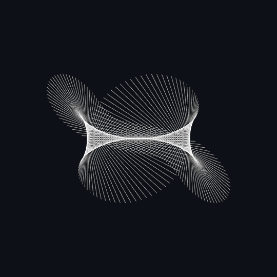
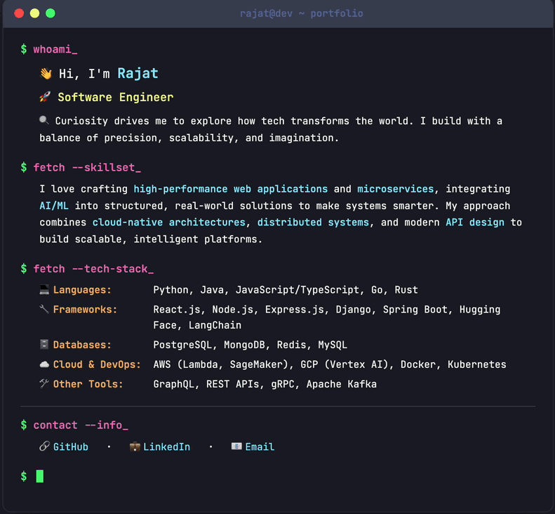

  
   
  

 
 

  

<h3 align="center">Let's build something amazing together</h3>

  

    

      
      &nbsp;&nbsp;&nbsp;
      
      &nbsp;&nbsp;&nbsp;
      
      &nbsp;&nbsp;&nbsp;
      
    

  

  

    
  

  

